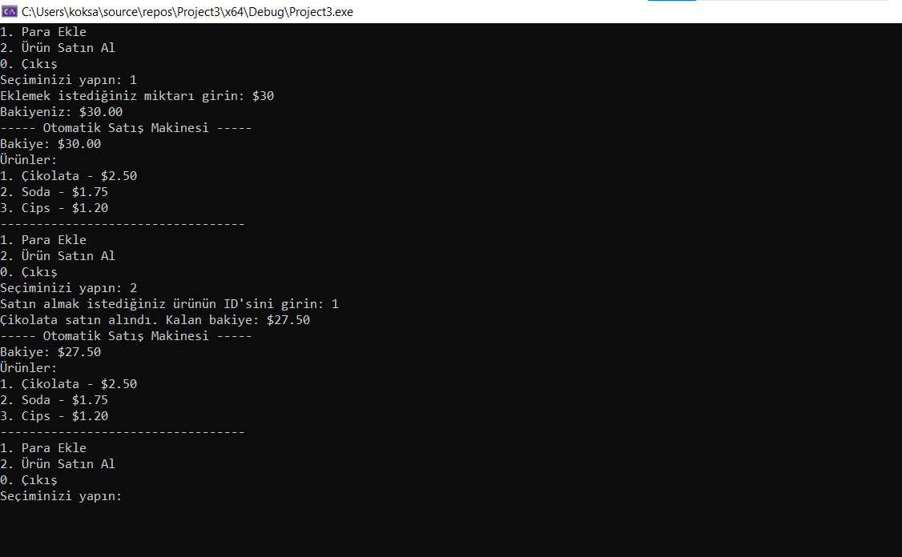

# Otomatik Satış Makinesi Uygulaması

Bu C++ uygulaması, basit bir otomatik satış makinesini simüle eder. Kullanıcılar, bakiyelerini artırabilir ve belirli ürünleri satın alabilirler.

## Nasıl Çalışır?

1. **Ürün Bilgileri:** Uygulama, başlangıçta bir ürün dosyasından ürün bilgilerini yükler. Bu bilgiler, her ürünün kimliği (ID), adı, fiyatı ve stok miktarını içerir.

2. **Menü Görüntüleme:** Kullanıcılar, mevcut bakiyelerini ve satın alınabilir ürünleri görmek için bir menü görüntüleyebilirler.

3. **Para Ekleme:** Kullanıcılar, bakiyelerini artırmak için belirli bir miktar para ekleyebilirler.

4. **Ürün Satın Alma:** Kullanıcılar, satın almak istedikleri ürünün ID'sini girebilirler. Yeterli bakiyeleri varsa ve ürün stokta ise satın alma işlemi gerçekleşir.

## Kullanım

1. **Başlangıç:** Ana menüden uygun seçenekleri seçin.
   
2. **Para Ekleme:** "Para Ekle" seçeneğini seçin ve eklemek istediğiniz miktarı girin.

3. **Ürün Satın Alma:** "Ürün Satın Al" seçeneğini seçin ve satın almak istediğiniz ürünün ID'sini girin.

4. **Çıkış:** "Çıkış" seçeneğini seçerek uygulamadan çıkış yapın.

## Örnek Ürün Dosyası (products.txt)

```
1 Çikolata 2.50 10
2 Soda 1.75 8
3 Cips 1.20 15
```


Her satır, bir ürünü temsil eder ve sırasıyla ID, ürün adı, fiyatı ve stok miktarını içerir.

## Örnek Kullanım

1. Para ekleyerek bakiyenizi artırın.
2. Menüden satın almak istediğiniz ürünü seçin.
3. Satın alma işlemi gerçekleştiğinde kalan bakiyenizi kontrol edin.

***Bu uygulama, temel C++ becerilerini pekiştirmek ve basit bir etkileşimli uygulama geliştirmek için kullanılabilir.***


# ÖNEMLİ
**₺** İşareti kullandığımız zaman ? işareti ile gösterilmesinin sebebi: *C++ dilinde Türkçe karakter seti (UTF-8) ile ilgili sorun.*


# Ekran Resmi


# Bilgilendirme
**---------------------------------------------------------**
| Herkese Açık | Geliştirilebilir | Zyra Software|
|---------|---------|---------|
| Açık | Geliştirilebilir |@zyrasoftware |

